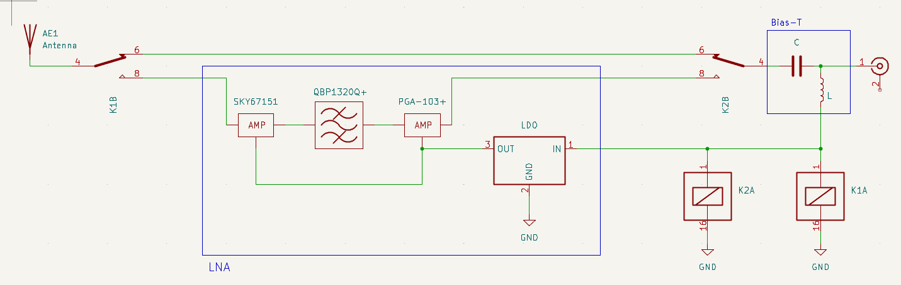
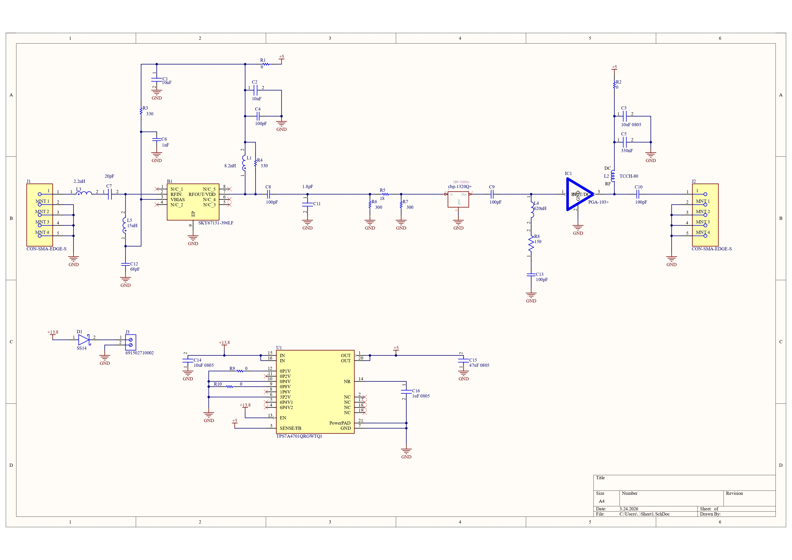
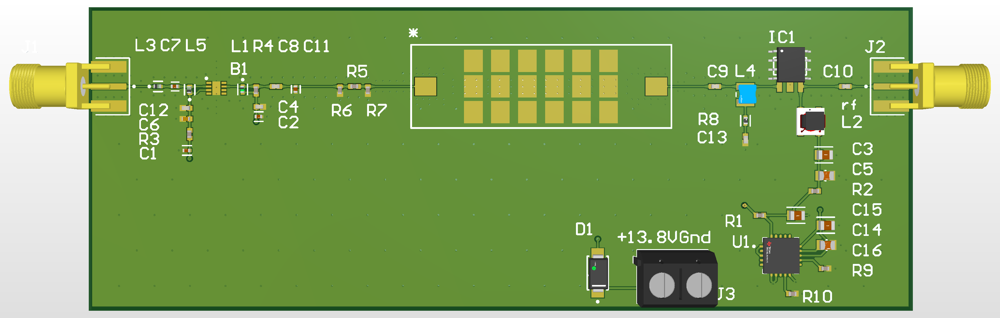
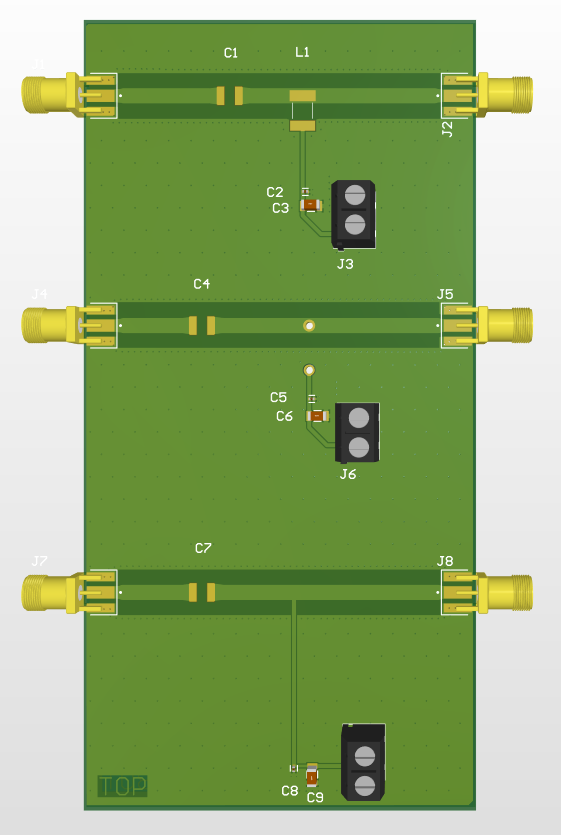
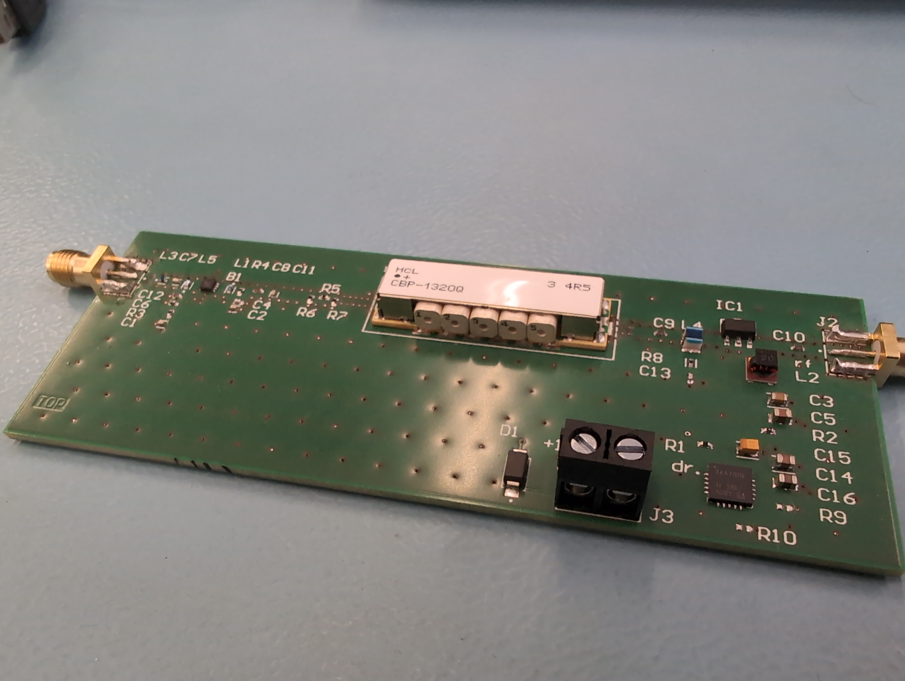
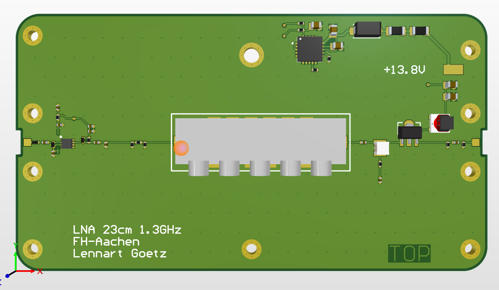

# Low-Noise-Amp-1296MHz

This project is part of my Bachelors Thesis to finish my degree in electrical engineering.

At our institution we already have a parabolic antenna for 23cm waves installed. In the future we aim to do a "moon bounce".
That means sending a singnal to the moon and receiving the reflected signal again. This is a known challenge amongst HAM Radion Community. It is known to be challenging due to the high path los.(250dB)
It is necessary to transmit with a very high power, and the receiver needs to add very little noise to the very small signal received back from the moon.

My main task is to design and build a Low Noise Amplifier that should me mounted on the roof near the antenna.

To protect the LNA when transmitting, we will use coaxial Relais and a Sequencer. These will disconnect the LNA from the Signal path to the antenna.
Please take a look at "Systemskizze.png" for a more detailed layout.

## LNA Topologie and parts

To ensure a good Noise-Figure (NF) we decided to build a LNA with a cascaded design of two amplifiers. The first Amp is optimized for a low noise figure, while the other amplifier can be optimized to reach the desired signal gain.
Inbetween the two amplifiers it is recommended to place a Bandpassfilter to remove interference and prevent Oscillations in the circuit.

We went with the following Options

- 1st Amp: SKY67151-396LF
- Bandpass: CBP-1320Q+
- 2nd Amp: PGA-103+

## HF Relais

As I mentioned before it is necessary to protect the LNA from the transmitting power. Therefore we need HF Relais which disconnect the LNA from the coaxial cable while the System is sending power to the antenna. The requirements for the relais are quite high. We need RF power of around 500W (which is a lot) and isolation between the two path of 70dB or more.

The gold standard in professional mobile Networks are "Spinner" Relais. However, those weight ~ 1.2kg, are very big, hard to find and the price is not publicly available.

Therefore we will use the Radiall R570022000. That is a smaller and less pricy Relais which can handle our system requirements.

## Bias T

As the Circuit in "Systemskizze.png" suggests, the Sequencer will feed DC into the coaxial cable. The DC will switch on the Relais and deliver power to the LNA. Therefore we need a Bias-T near the antenna to seperate the HF signal and the DC power. That Bias-T has to handle the full Transmit power of around 500 Watts. Just like the Relais, this is a very specific system requirement. Luckily there are parts available for HAM-Radio Community, which we can use in our System.

We decided to use the following Bias-T:
23cm 600W Bias Tee 1240 to 1320MHz Outdoor from Antenna Amplifiers

## Update 24.03.2026

After simulation the RF Signal, the Schematic and PCB were designed. The following features were added to the final Design:

### power supply

There are two possibilities to supply the ICs with 5V. The obvious one is to configure the LDO for 5V and directly connect it to the ICs with some Capacitors. The second option is to configure it to a higher voltage and place Resistors in series. The voltage drop over the resistors will bring the voltage back down to 5V. The theoretical advantage of this is, that the resistors form low pass filters with the capacitors. However, this brings the risk of the voltage droping more when the current rises. (more voltage drop across the resistor, therefore less voltage for the IC)
To try both configurations, the Design has some Resistors which can be bridged or left open, to configure it accordingly. Please refer to the Datasheet of the LDO for more information. Once the PCB arrives, I will test which option brings better results.

### waveguides

In RF PCB Design it is very important to know the exact layer stack that the manufacturer uses. However, our supplier only has a defined layer stacks for 4 Layers or more. Due to that, my Design is a 4 Layer PCB. The Components have to be on the top (or bottom) layer, and the ground layer should be directly underneath. The distance between the signal layer and the ground layer is very small in that case. In my case it is 0.14mm.

The SKY67151 and the CBP-1320Q+ are both designed for grounded coplanar wave guide transmission line. I used the internal Altium Layer stack manager to calculate the track with for that wave guide. Unfortunately the small distance between signal Layer and ground plane results in a very thin track width. In my case the track width is 0.207mm and 0.127mm gap to the ground planes.

That brings the issue, that the 0402 components (Resistors, Capacitors...) are quite a lot bigger than the track itself. This results in a change of impedance as the signals hits the component. To encounter this Problem I applied to measures:

- Tapering: slowly increasing the width of the track to decrease the parasitc impedance
- ground cutout: The "big" pads of the 0402 components have a bigger capacitance against ground than they are supposed to. A cutout in the ground plane reduces the effective area of the pad against ground and brings the capacitance down.

## Update 05.04.2026
Due to some problems with ordering the Bias-T (and also for the fun of it) I will design my own version of the Bias-T. As I mentioned before, it is quite hard to find a product that can handel such a high RF Power. However, the concept of a Bias-T is really quite simple. Its just one Capacitor to Block DC from going into RF-Path, and one Inductor to block the RF to go into the DC Path. 

Regarding our system there are two special aspects
 - pro: we will only operate on 1.3GHz, the Bias-T only needs to work on that frequency
 - con: the power requirements for the Bias-T is huge (~500W RF Power, ~230V)

With these requirements, the inductor was the main challenge to design the Bias-T. A suitable Capacitor was found quite quickly 

(Kyocera AVX 800B101)
 - self resonant frequency is high enough
 - can handle the Voltage in our system

The Inductor was a bit more tricky though. Traditionally, the manufacturers of the Inductors do not supply data for the max voltage across the Inductor, because it was irrelevant for most use cases in the past. My usecase is a bit unordinary, so I texted the technical support from coilcraft. They replied and mentioned that the Inductor I chose, might be able to handle the Voltage. However, I decided to implement 3 different approches on my first test PCB, just to give it a try. 

1. Normal Bias T with Inductor from Coilcraft
2. Bias T with Hand made Inductor from copper wire
3. Bias T with a quarter wave length stub

The third approch is quite interesting in my opinion. In theory, the quarter wave length stub with the capacitor at its end, should act like a inductor. (so the RF Signal should see an open circuit there)
However this will only work for the frequency it was designed for. Really looking forward to testing this one. 

## Update 23.04.2026
After the PCB and the parts for the LNA arrived, I used the local lab to assemble it. A vapor phase soldering machine was available for that and I totally happy with the results. The form factor of that machine is quite small and the results are super professional. I would definetly not recommend hand soldering the whole pcb, the SKY67151 and the Voltage regulator are just not accessible with a soldering iron. 

After the assembly, I carefully connected the PCB to power supply and checked for some parts getting too hot. And indeed I found out that **in the current version of the schematic one of the resistors is wrong**. R3 aims to set the Bias current for the Amplifier and it should be around 9.1k Ohm, not 330 Ohm. However I was lucky enaugh that after changing the resistor, the Amplifier still works as intended.

After fixing that error I was able to test the pcb and I was very happy that it actually did what it was supposed to. In the following days I soldered a lot and tried to minimize the overall Noise-Figure of the device. That is done by adjusting the input impedance. Please refer to the SKY67151 data sheet for more detailed information. Here you can see some of the results that I measured:

  
  

Now that I confirmed that the concept works fine, I will start to design the next (and maybe final) version of the LNA. A suitable housing already exists, so the main challenge in that part will be to bring the pcb inside with clean transitions for the Signal. 

## Update 28.04.2026
In the last week I completed the new design in Altium. More or less the schematic remained the same, apart from the DC supply. I placed two resistors in front of the Voltage regulator, because the LDO was quite hot while the LNA was running. These two resistors will reduce the voltage from 13.8V to ~8V so that the thermal stress for the voltage regualator is less severe. This is known as thermal load sharing. 

Apart from that I only reformated the pcb to the new housing. That meant moving the DC circuit to the top part of the PCB. As a result I had to pass the DC supply under the RF path once, but I hope there wont be any issues because the setup is identical in the reference Layout for the SKY67151. 

One possible issue I already see with this PCB and my housing is the DC trace on the backside of the PCB. The backside is in full contact with aluminium when it is bolted into the housing. If the solder mask layer is damaged, the DC traces might short cicuit to grounded aluminium. I think I will place some isolating tape on the backside to prevent this from happening. 
