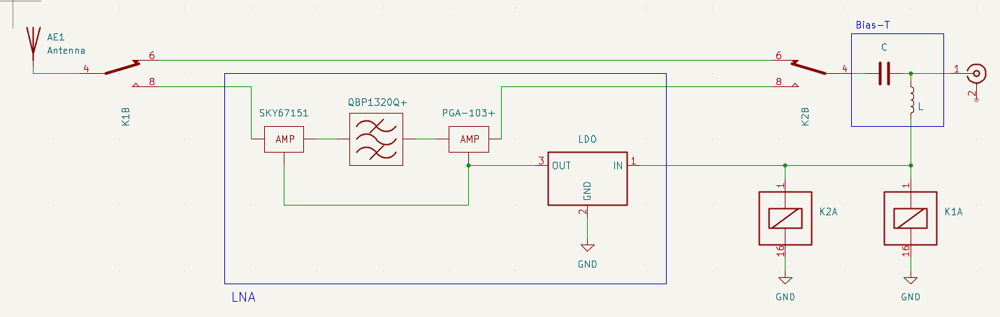
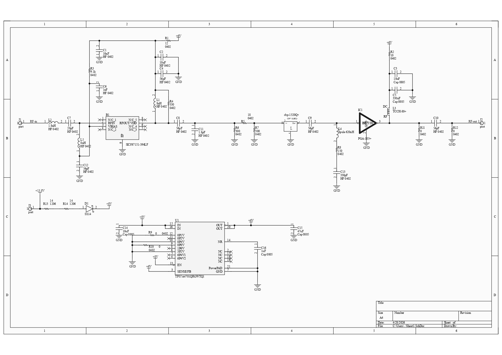
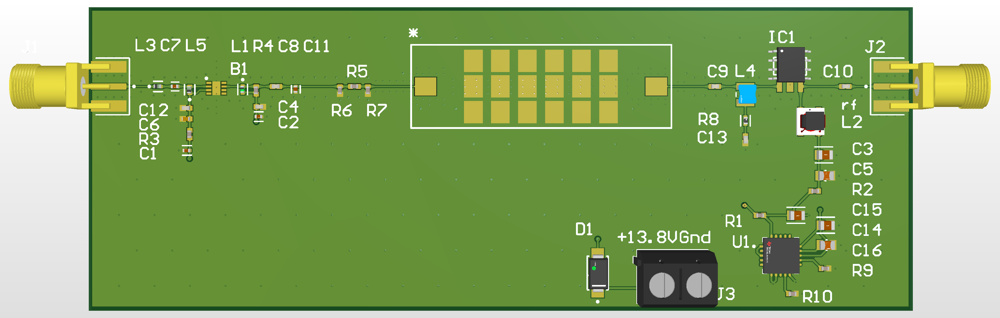
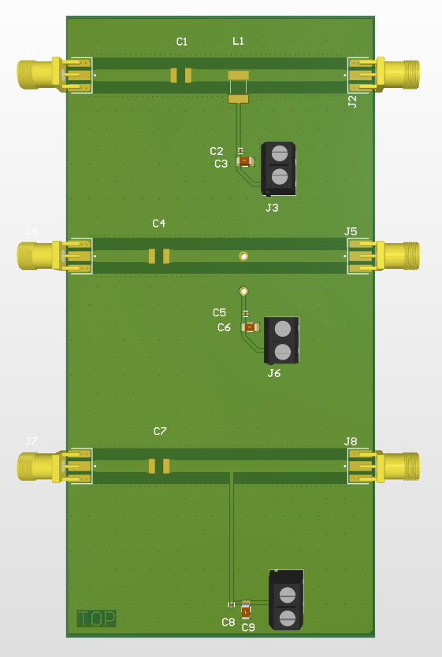
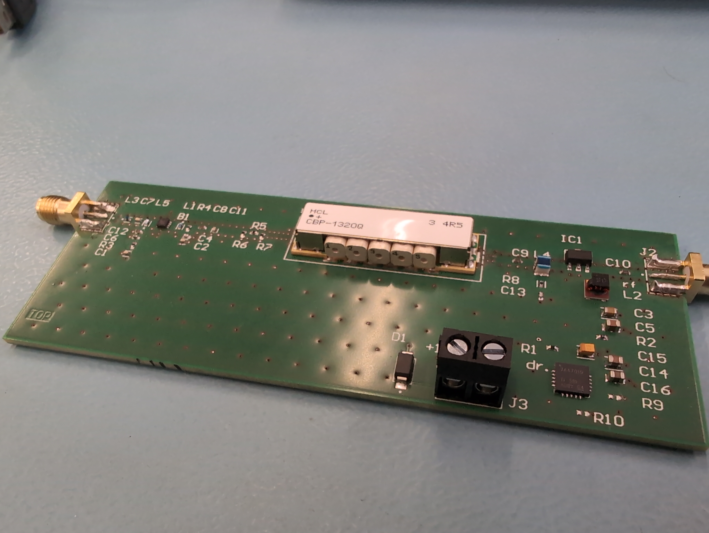
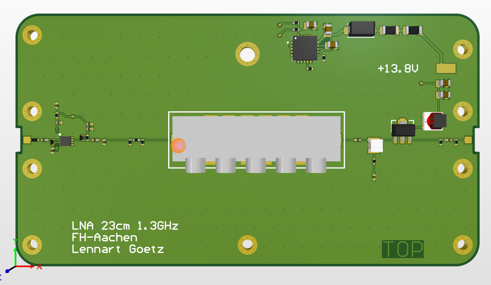
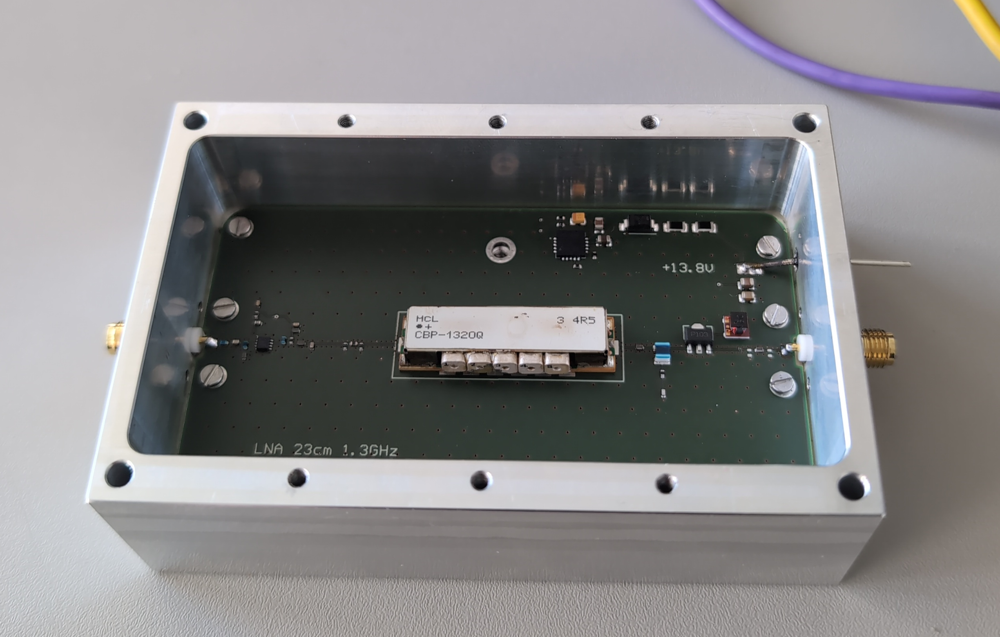
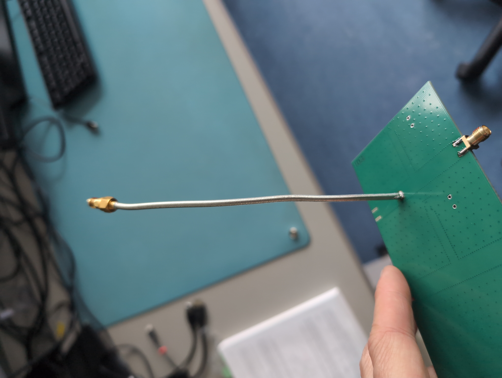

# Low-Noise-Amp-1296MHz

This project is part of my Bachelor's thesis to finish my degree in electrical engineering.

At our institution, we already have a parabolic antenna for 23 cm waves installed. In the future, we aim to do a "moon bounce".
That means sending a signal to the moon and receiving the reflected signal again. This is a known challenge amongst the HAM radio community. It is known to be challenging due to the high path loss (250 dB).
It is necessary to transmit with very high power, and the receiver needs to add very little noise to the very small signal received back from the moon.

My main task is to design and build a Low Noise Amplifier that should be mounted on the roof near the antenna.

To protect the LNA when transmitting, we will use coaxial relays and a sequencer. These will disconnect the LNA from the signal path to the antenna.
Please take a look at "Systemskizze.png" for a more detailed layout.

## LNA Topology and parts

To ensure a good noise figure (NF), we decided to build an LNA with a cascaded design of two amplifiers. The first amp is optimized for a low noise figure, while the other amplifier can be optimized to reach the desired signal gain.
In between the two amplifiers, it is recommended to place a bandpass filter to remove interference and prevent oscillations in the circuit.

We went with the following options

- 1st Amp: SKY67151-396LF
- Bandpass: CBP-1320Q+
- 2nd Amp: PGA-103+

## HF relays

As I mentioned before, it is necessary to protect the LNA from the transmitting power. Therefore, we need HF relays which disconnect the LNA from the coaxial cable while the system is sending power to the antenna. The requirements for the relays are quite high. We need RF power of around 500 W (which is a lot) and isolation between the two paths of 70 dB or more.

The gold standard in professional mobile networks are "Spinner" relays. However, those weigh ~ 1.2 kg, are very big, hard to find, and the price is not publicly available.

Therefore, we will use the Radiall R570022000. That is a smaller and less pricey relay which can handle our system requirements.

## Bias T

As the circuit in "Systemskizze.png" suggests, the sequencer will feed DC into the coaxial cable. The DC will switch on the relays and deliver power to the LNA. Therefore, we need a Bias-T near the antenna to separate the HF signal and the DC power. That Bias-T has to handle the full transmit power of around 500 watts. Just like the relays, this is a very specific system requirement. Luckily, there are parts available for the HAM radio community, which we can use in our system.

We decided to use the following Bias-T:
23 cm 600 W Bias Tee 1240 to 1320 MHz Outdoor from Antenna Amplifiers

## Update 24.03.2026

After simulating the RF signal, the schematic and PCB were designed. The following features were added to the final design:

### power supply

There are two possibilities to supply the ICs with 5 V. The obvious one is to configure the LDO for 5 V and directly connect it to the ICs with some capacitors. The second option is to configure it to a higher voltage and place resistors in series. The voltage drop over the resistors will bring the voltage back down to 5 V. The theoretical advantage of this is that the resistors form low-pass filters with the capacitors. However, this brings the risk of the voltage dropping more when the current rises. (more voltage drop across the resistor, therefore less voltage for the IC)
To try both configurations, the design has some resistors which can be bridged or left open, to configure it accordingly. Please refer to the datasheet of the LDO for more information. Once the PCB arrives, I will test which option brings better results.

### waveguides

In RF PCB design, it is very important to know the exact layer stack that the manufacturer uses. However, our supplier only has defined layer stacks for 4 layers or more. Due to that, my design is a 4-layer PCB. The components have to be on the top (or bottom) layer, and the ground layer should be directly underneath. The distance between the signal layer and the ground layer is very small in that case. In my case, it is 0.14 mm.

The SKY67151 and the CBP-1320Q+ are both designed for grounded coplanar waveguide transmission line. I used the internal Altium layer stack manager to calculate the track width for that waveguide. Unfortunately, the small distance between signal layer and ground plane results in a very thin track width. In my case the track width is 0.207 mm and 0.127 mm gap to the ground planes.

That brings the issue, that the 0402 components (resistors, capacitors...) are quite a lot bigger than the track itself. This results in a change of impedance as the signals hits the component. To encounter this problem I applied two measures:

- Tapering: slowly increasing the width of the track to decrease the parasitic impedance
- Ground cutout: The "big" pads of the 0402 components have a bigger capacitance against ground than they are supposed to. A cutout in the ground plane reduces the effective area of the pad against ground and brings the capacitance down.

## Update 05.04.2026

Due to some problems with ordering the Bias-T (and also for the fun of it) I will design my own version of the Bias-T. As I mentioned before, it is quite hard to find a product that can handle such a high RF power. However, the concept of a Bias-T is really quite simple. It's just one capacitor to block DC from going into RF-Path, and one inductor to block the RF from going into the DC path.

Regarding our system there are two special aspects
 - pro: we will only operate on 1.3 GHz, the Bias-T only needs to work on that frequency
 - con: the power requirements for the Bias-T is huge (~500 W RF Power, ~230 V)

With these requirements, the inductor was the main challenge to design the Bias-T. A suitable capacitor was found quite quickly

(Kyocera AVX 800B101)
 - self resonant frequency is high enough
 - can handle the voltage in our system

The inductor was a bit more tricky though. Traditionally, the manufacturers of the inductors do not supply data for the max voltage across the inductor, because it was irrelevant for most use cases in the past. My use case is a bit unordinary, so I texted the technical support from Coilcraft. They replied and mentioned that the inductor I chose, might be able to handle the voltage. However, I decided to implement 3 different approaches on my first test PCB, just to give it a try.

1. Normal Bias T with inductor from Coilcraft
2. Bias T with hand made inductor from copper wire
3. Bias T with a quarter wavelength stub

The third approach is quite interesting in my opinion. In theory, the quarter wavelength stub with the capacitor at its end, should act like a inductor. (so the RF signal should see an open circuit there)
However this will only work for the frequency it was designed for. Really looking forward to testing this one.

## Update 23.04.2026

After the PCB and the parts for the LNA arrived, I used the local lab to assemble it. A vapor phase soldering machine was available for that and I am totally happy with the results. The form factor of that machine is quite small and the results are super professional. I would definitely not recommend hand soldering the whole PCB, the SKY67151 and the voltage regulator are just not accessible with a soldering iron.

After the assembly, I carefully connected the PCB to power supply and checked for some parts getting too hot. And indeed I found out that **in the old version of the schematic one of the resistors is wrong**.(the schematic I uploaded should be correct) R3 aims to set the bias current for the amplifier and it should be around 9.1 kOhm, not 330 Ohm. However I was lucky enough that after changing the resistor, the amplifier still works as intended.

After fixing that error I was able to test the PCB and I was very happy that it actually did what it was supposed to. In the following days I soldered a lot and tried to minimize the overall noise figure of the device. That is done by adjusting the input impedance. Please refer to the SKY67151 datasheet for more detailed information. Here you can see some of the results that I measured:

  
  

Now that I confirmed that the concept works fine, I will start to design the next (and maybe final) version of the LNA. A suitable housing already exists, so the main challenge in that part will be to bring the PCB inside with clean transitions for the signal.

## Update 28.04.2026
In the last week I completed the new design in Altium. More or less the schematic remained the same, apart from the DC supply. I placed two resistors in front of the voltage regulator, because the LDO was quite hot while the LNA was running. These two resistors will reduce the voltage from 13.8 V to ~8 V so that the thermal stress for the voltage regulator is less severe. This is known as thermal load sharing.

Apart from that I only reformatted the PCB to the new housing. That meant moving the DC circuit to the top part of the PCB. As a result I had to pass the DC supply under the RF path once, but I hope there won't be any issues because the setup is identical in the reference layout for the SKY67151.

One possible issue I already see with this PCB and my housing is the DC trace on the backside of the PCB. The backside is in full contact with aluminium when it is bolted into the housing. If the solder mask layer is damaged, the DC traces might short circuit to grounded aluminium. I think I will place some isolating tape on the backside to prevent this from happening.

## Update 17.05.2026
After the PCB arrived I was quite happy that it fit mechanically into my aluminium housing. After that, I assembled the board with our vapor phase soldering machine. Just like last time, it worked like a charm. I checked the current and voltage levels and everything seemed to work fine. However, when I measured the S21 on our vector analyzer, I was a bit disappointed. The characteristics looked not even close to the measurement on the prototype.

  
  

Right now I assume the bandpass filter is the source of the problem. That part is pretty expensive so we decided to desolder it from the prototype and reuse it. I think the massive heat from desoldering damaged the part. A new part is ordered and fingers are crossed, that the issue will be fixed soon.

While waiting for the PCBs to arrive, I took some time to think about the mechanical side of the project. A housing is already available, but it is quite small for the required parts. The main problem are the Type-N connectors. The system will operate on such a high RF power that we can not use SMA or other small coaxial connector. The Type-N connectors can handle the RF power, but they are also very bulky.

After thinking for a bit I decided to minimize the total numbers of connectors in the system by soldering cables wherever possible. I was able to find a semi rigid cable with approximately 4 mm outer diameter that can handle 500 W at 1.3 GHz. I did a test and soldered the coax cable directly to a microstrip waveguide on my Bias-T PCB. I measure it on the VNA and the results are pretty promising. S11 was around -25 dB and S21 was around -0.2 dB.

