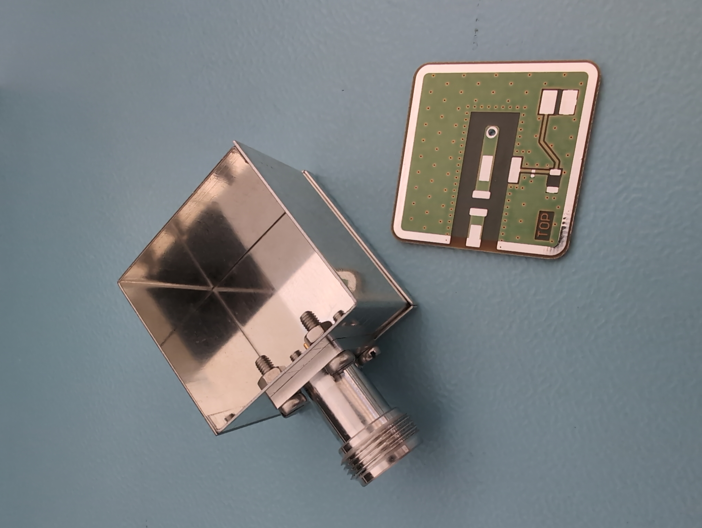
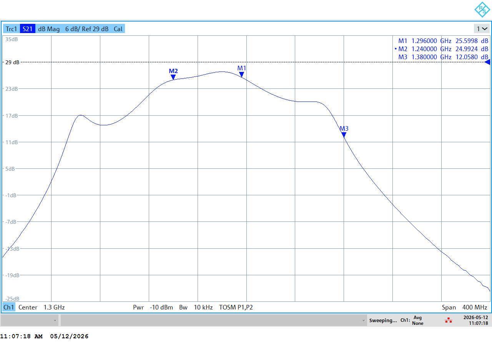
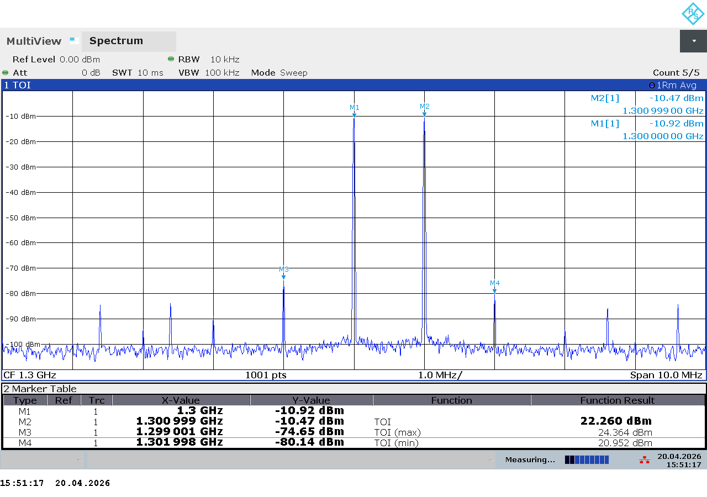
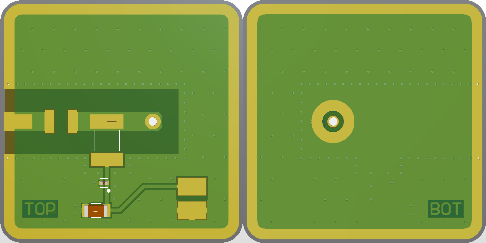

# 1.3 GHz Low-Noise Amplifier Front-End

This repository contains the design files for a finished and RF-characterized 1.3 GHz low-noise amplifier front-end intended for weak-signal reception, especially Earth-Moon-Earth (EME) operation in the 23 cm amateur radio band.

The project includes a low-noise amplifier, a high-power Bias-T concept, PCB production files, schematics, mechanical drawings, and measurement results. The goal of this repository is to make the design reproducible and to give RF engineers a realistic impression of the measured performance.

  
  

## Overview

The front-end is designed for operation around **1.3 GHz** and consists mainly of:

- a two-stage **low-noise amplifier** with integrated band-pass filtering,
- a compact **Bias-T** for remote supply and high-power RF path requirements,
- system-level integration for a transmit/receive front-end,
- mechanical mounting and enclosure concept.

The LNA is optimized for low noise figure and sufficient gain directly at the antenna side of the receive chain. The Bias-T was designed with low insertion loss and a high RF power target in mind.

  

## Measured Performance

The following values summarize the characterized final design at approximately **1.3 GHz**.

| Module | Parameter | Measured result |
|---|---:|---:|
| LNA | Gain | **30.57 dB** |
| LNA | Noise figure | **0.47 dB** |
| LNA | Input return loss, S11 | **-9.7 dB** |
| LNA | Output return loss, S22 | **-11.1 dB** |
| LNA | IIP3 | **-8.63 dBm** |
| Bias-T | Insertion loss | **0.45 dB** |
| Bias-T | Input/output matching | **< -15 dB** in the useful band |
| Bias-T | RF power design target | **500 W CW** |

  
  

The LNA achieves a sub-0.5 dB noise figure together with roughly 30 dB gain, making it suitable as the first active stage in a low-noise receive system. The integrated filtering improves out-of-band suppression compared with a broadband amplifier-only approach.

## Hardware

### Low-Noise Amplifier

The final LNA PCB is a compact RF board for 1.3 GHz operation. It uses microstrip matching and an integrated band-pass filter. The released production files are intended to allow the board to be manufactured and assembled reproducibly.

  

### Bias-T

The Bias-T provides DC injection while maintaining a low-loss RF path. The final version uses an RF choke approach instead of a quarter-wave stub to reduce board size and improve broadband behavior.

  

## Repository Contents

Important files for reproduction are located in `ok_git/`:

- `ok_git/LNA_V2_gerber.zip` – final LNA PCB production files
- `ok_git/Bias_T_V2_gerber.zip` – final Bias-T PCB production files
- `ok_git/schematic.pdf` – system schematic
- `ok_git/mechanik/` – mechanical drawings and enclosure-related files
- `ok_git/images/` – photos, renderings, and measurement screenshots

Earlier prototype files are also included for reference.

## Reproduction Notes

- The design targets the 1.3 GHz / 23 cm band.
- Keep RF input interconnects as short and low-loss as possible, especially before the LNA input.
- Use suitable RF connectors, coaxial cables, and enclosure grounding for repeatable results.
- For the Bias-T, verify thermal behavior and voltage margins for the intended transmit power and duty cycle in the final installation.
- After assembly, characterize S-parameters and noise figure before using the module in a receive chain.

## License

No explicit license information is included in this repository yet. Please contact the author before using the design commercially or redistributing modified versions.
